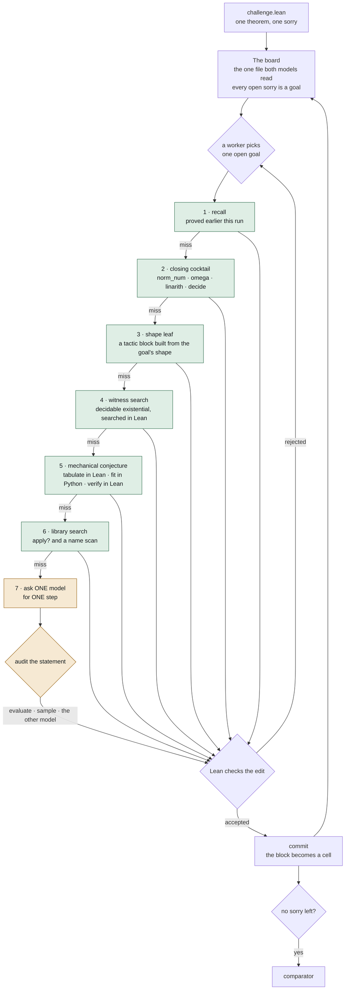
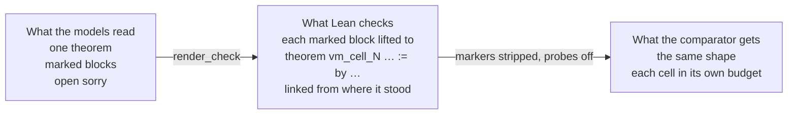

# Architecture

Two models share one Lean file. Every open `sorry` on it is a goal, and a model is
the last thing the system pays for, not the first.

## One goal, one turn

A worker picks an open goal and walks down a ladder. The first rung that closes the
goal ends the turn, and only the last two rungs cost tokens.

Green closes a goal with no model asked; amber spends tokens. Most goals never reach
the amber rungs, which is why most problems finish in well under a minute.

## Cells: the file Lean checks is not the file the models read

Each accepted step is marked, and the checked file lifts every marked block into a
declaration of its own, placed above the proof it came from and linked from where it
stood.

One declaration is one heartbeat budget and one re-elaboration. Measured on
`rmo_2001_2`, the divisor step needs about 170000 heartbeats by itself, so on a board
carrying any earlier work it never ran once: five tries, every one at the limit.
Measured on `p10`, a single-theorem board grew about 300 MB of REPL memory per check;
with cells a small check retains about 2 MB.

## Nothing a model states is taken on trust

A step is not only compiled, it is checked for meaning before it joins the board.

* A statement whose binders can be walked is **evaluated**: instantiate the naturals,
  decide the claim in Lean, and one counterexample refutes it.
* A statement about a sequence is **sampled**: the reals become rationals, six candidate
  sequences are tried, and a sample that meets every hypothesis and breaks the claim
  kills it.
* Anything neither method reaches goes to **the other model**.

That is what the second model is for. It is not a vote and not an ensemble, it is the
fallback auditor for claims Lean cannot decide by itself. On `rmo_2000_3` the sampled
audit refuted 3 of 47 statements the auditing model had passed as "unverified".

## Search, and the part that is still weak

The board keeps three whole-file branches ranked by how many goals are open. A goal that
will not move sends its cell back to `sorry` on a fork, so undoing one step keeps the
rest, and a statement proved before a reset is replayed when the same goal reappears.

This is still a ranked list of whole files, not a proof tree. A route that was 80% right
is thrown away together with the wrong 20%, and nothing in the harness chooses between
two rival decompositions of the same goal. A tree with alternatives as siblings is the
next change, and it is not built.

## Where the sixteen problems land

One run per problem, sequential on an idle 28-core host, under
`outputs/board-2026-09-06/`. Every proof was accepted by the kit's Comparator. The
median problem takes 22 s, 13 of the 16 finish under a minute, and the slowest takes
seven minutes of the eight-hour budget. The whole set costs 1.3 cents and asks a
model 42 times.

Wall is the agent's own clock, the comparator excluded, which adds 15 to 30 s per
problem. `p06_pow_mod`, `p09_imo1964` and `putnam_2020_a2` all land within 15 s of
the minute mark, so with one run each the count under a minute is the least stable
number here.

| Problem | Wall | Model requests | Problem | Wall | Model requests |
| --- | --- | --- | --- | --- | --- |
| p01_linear | 3.2 s | 0 | p09_imo1964 | 50.1 s | 3 |
| p02_frac_cancel | 3.3 s | 0 | p10_factorial_pow | 271.7 s | 26 |
| p03_sq_ge_two_ab | 9.2 s | 3 | putnam_2018_a1 | 29.6 s | 0 |
| p04_sum_sq | 3.5 s | 0 | putnam_2020_a2 | 47.8 s | 0 |
| p05_gcd_mersenne | 3.0 s | 0 | rmo_2000_2 | 23.8 s | 0 |
| p06_pow_mod | 64.1 s | 0 | rmo_2000_3 | 19.9 s | 0 |
| p07_least_divisible | 13.8 s | 1 | rmo_2000_6 | 30.4 s | 0 |
| p08_sum_products | 12.5 s | 4 | rmo_2001_2 | 416.5 s | 5 |

The reply counts are here as measurement, not as a claim. Every deterministic rung was
written after watching both models fail the same step in a measured run, and a holdout
problem off those shapes reaches the model rung immediately.

`rmo_2000_3` carries a note that belongs with its number. As published, its
challenge file did not build in the comparator at all: it answers
`Challenge.lean:10:15: Function expected at Ico`, because `Finset.Ico` on ℕ needs
`Mathlib.Order.Interval.Finset.Nat` and the sum needs
`Mathlib.Algebra.BigOperators.Group.Finset.Basic`, and the file imported neither.
The harness hands the challenge to the comparator verbatim while a system only ever
writes the solution, so no submission of any kind could score it. This repository
adds those two imports to `sample-problems/rmo_2000_3/challenge.lean`, and that is
the only change to a problem file. Measured with the same solution in both runs:
the published challenge gives the comparator `exit 1` at `Building Challenge`, and
with the imports it gives `exit 0`. The leaf this problem exercises earns its place
on the holdout rather than here.

## Three routes that moved off the models

Each was a problem the models could nearly do and kept losing: they would state the
step that mattered and withdraw it. Each is now one shape-triggered block, checked once.

| Problem | Shape | Before | After |
| --- | --- | --- | --- |
| rmo_2000_3 | a sum bounded through its squares | 0 of 4 | 1/1 twice, 22 s, no model call |
| rmo_2000_6 | least element of a product set | 9 of 16, a loss cost 2638 s and $0.13 | 1/1 twice, 31 s, no model call |
| putnam_2018_a1 | reciprocals against a listed set | 8 of 11 | 1/1 twice, 31 s, no model call |

The holdout runs each problem once, so the expected score is the sum of per-problem
pass probabilities. The work worth doing was not new capability, it was taking the
variance out of three problems that were already winnable and sometimes lost.

## Where each of these lives

The sections above are the mechanism. This is the same thing keyed to files, so
that a claim above and the code under it can be read together. Line counts are
of the package as submitted.

| What the section above calls it | Where it is |
| --- | --- |
| the entry point the harness loads | `submission/agent.py` (16) |
| the spine: setup, then two workers on the board | `submission/board_agent.py::solve` (66 of 356) |
| one worker's turn, the `or` chain of rungs | `submission/run/loop.py::turn` |
| 1 · recall | `run/loop.py`, against `Blackboard.proven` |
| 2 · closing cocktail | `run/ladder.py::sweep`, tactic list in `submission/sweep.py` |
| 3 · shape leaf | `run/ladder.py::leaf_sweep`, blocks in `submission/leaves.py` |
| 4 · witness search | `run/ladder.py::witness_sweep`, files in `board/probes.py` |
| 5 · mechanical conjecture | `run/ladder.py::generalise_sweep`, fit in `submission/conjecture.py` |
| 6 · library search (`apply?`) | `run/ladder.py::library_sweep` |
| 7 · ask ONE model for ONE step | `submission/run/asking.py` |
| audit: evaluate · sample · the other model | `run/asking.py::audit`, `board_agent.py::_audit_root`, `submission/sampling.py` |
| Lean checks the edit, accept or reject | `run/asking.py::judge_once` |
| commit, and the branches beside it | `submission/run/blackboard.py` |
| carrying a half-checked board across | `board/types.py::carry_goals`, `carry_messages`, `reparent_target` |
| cells: the file Lean checks | `submission/cells.py`, `render_check` at `:182` |
| what would be handed in if killed now | `submission/run/delivery.py` |
| what the comparator will and will not accept | `submission/contract.py` |
| the Lean tactics written by hand | `submission/techniques.py` |

Two packages sit under `submission/`. `run/` holds the seven parts above that
carry state, in a strict chain. It runs `context → budget → delivery →
blackboard → asking → ladder → loop`, each importing only from its left. `board/` holds
functions with no state: `types` is the vocabulary, `reply` reads a model's
answer, `text` rewrites the Lean, `probes` builds files that ask Lean one
question.

The chain is not the whole picture, and two pieces of state sit across it
rather than inside it.

One record per goal (`Notes`, keyed by the goal's content) is written from four
of those parts (`loop` 40 times, `blackboard` 15, `ladder` 11, `asking` 4), so
it is shared rather than owned, and it is the thing to read first when a goal's
history looks wrong.

`Blackboard.lenient` is the second. While it is set a Lean check may take the
cap timeout and a slow step is not held against whoever wrote it, which is what
work whose cost is paid once needs: a leaf block, or a step that closes its
goal. `Ladder` opens it, `Blackboard` and `Asking` read it, and it is a window
rather than an argument because it has to cover the commit as well as the
checks. It lives on `Blackboard` because it is a policy about checking, not
about money, and every part that touches it is to `Blackboard`'s right.

`BoardAgent` inherits from `FrameworkAgent` (`submission/framework_agent.py`),
which is a base class and nothing else: it is never instantiated. The board
overrides `_share` and `_call`, adds `_define` and `solve`, and borrows
`_ask_plan`, `_probe`, `_resolve_answers` and `_finish` unchanged. Below both
sits `submission/framework.py`, pure transforms over Lean text.

The hardest part of this is `Blackboard.look`, and it is worth stating on its
own. A check with a focus shows Lean one cell and stubs the rest, so Lean
reports no goal for anything outside that cell, and the rest of the board has
to be carried across a file whose line numbers have moved. Three functions in
`board/types.py` do it, and between them they guarantee this:

> A goal on a probed line was checked and is Lean's. Every other goal keeps
> the text and statement it had on the base board, matched by file order.

That pairing holds only while a focused check neither adds nor removes
placeholders outside the unit, so `carry_goals` returns None the moment that
count moves and `look` checks the whole file instead. `reparent_target`
handles the case where the cell closed and Lean moved its goal up to the
parent's header, and `carry_messages` moves the base's messages by however
much the region grew, dropping a goal report that no placeholder is left
under.

The four branches were counted before they were named. Over the six
deterministic problems the carry path runs 25 times and the reparent once,
while the count mismatch and the nested-cell message exception never run at
all, so no recorded run is a net under those two. Six tests in
`tests/test_board_agent.py` are, each one checked by mutating the function it
covers and confirming the test fails.
