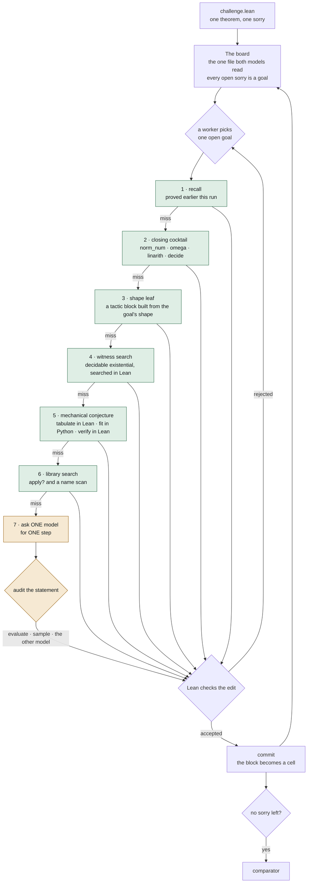
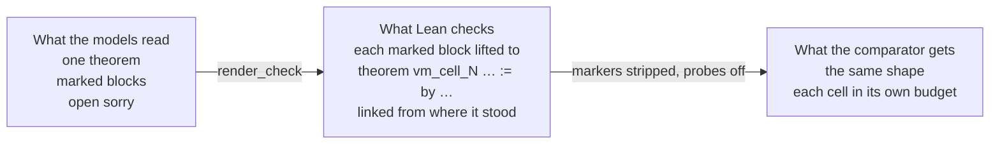

# Architecture

Two models share one Lean file. Every open `sorry` on it is a goal, and a model is
the last thing the system pays for, not the first.

## One goal, one turn

A worker picks an open goal and walks down a ladder. The first rung that closes the
goal ends the turn, and only the last two rungs cost tokens.

Green closes a goal with no model asked; amber spends tokens. Most goals never reach
the amber rungs, which is why most problems finish in well under a minute.

## Cells: the file Lean checks is not the file the models read

Each accepted step is marked, and the checked file lifts every marked block into a
declaration of its own, placed above the proof it came from and linked from where it
stood.

One declaration is one heartbeat budget and one re-elaboration. Measured on
`rmo_2001_2`, the divisor step needs about 170000 heartbeats by itself, so on a board
carrying any earlier work it never ran once: five tries, every one at the limit.
Measured on `p10`, a single-theorem board grew about 300 MB of REPL memory per check;
with cells a small check retains about 2 MB.

## Nothing a model states is taken on trust

A step is not only compiled, it is checked for meaning before it joins the board.

* A statement whose binders can be walked is **evaluated**: instantiate the naturals,
  decide the claim in Lean, and one counterexample refutes it.
* A statement about a sequence is **sampled**: the reals become rationals, six candidate
  sequences are tried, and a sample that meets every hypothesis and breaks the claim
  kills it.
* Anything neither method reaches goes to **the other model**.

That is what the second model is for. It is not a vote and not an ensemble, it is the
fallback auditor for claims Lean cannot decide by itself. On `rmo_2000_3` the sampled
audit refuted 3 of 47 statements the auditing model had passed as "unverified".

## Search, and the part that is still weak

The board keeps three whole-file branches ranked by how many goals are open. A goal that
will not move sends its cell back to `sorry` on a fork, so undoing one step keeps the
rest, and a statement proved before a reset is replayed when the same goal reappears.

This is still a ranked list of whole files, not a proof tree. A route that was 80% right
is thrown away together with the wrong 20%, and nothing in the harness chooses between
two rival decompositions of the same goal. A tree with alternatives as siblings is the
next change, and it is not built.

## Where the sixteen problems land

One run per problem, one worker, commit `4e3e4c7`. Every proof was accepted by the
kit's Comparator. The median problem takes 31 s, 13 of the 16 finish under a minute,
and the slowest takes seven minutes of the eight-hour budget.

| Problem | Wall | Model replies | Problem | Wall | Model replies |
| --- | --- | --- | --- | --- | --- |
| p01_linear | 3.3 s | 0 | p10_factorial_pow | 297.9 s | 23 |
| p02_frac_cancel | 3.3 s | 0 | putnam_2018_a1 | 30.2 s | 0 |
| p03_sq_ge_two_ab | 9.6 s | 3 | putnam_2020_a2 | 52.8 s | 0 |
| p04_sum_sq | 3.4 s | 0 | rmo_2000_2 | 23.4 s | 0 |
| p05_gcd_mersenne | 3.0 s | 0 | rmo_2000_3 | 20.1 s | 0 |
| p06_pow_mod | 59.9 s | 0 | rmo_2000_6 | 31.1 s | 0 |
| p07_least_divisible | 56.2 s | 2 | rmo_2001_2 | 421.1 s | 9 |
| p08_sum_products | 19.8 s | 4 | | | |
| p09_imo1964 | 73.4 s | 3 | **16 of 16** | **median 31 s** | |

The reply counts are here as measurement, not as a claim. Every deterministic rung was
written after watching both models fail the same step in a measured run, and a holdout
problem off those shapes reaches the model rung immediately.

`rmo_2000_3` carries a caveat that belongs with its number. As published, its
challenge file does not build in the comparator at all: it answers
`Challenge.lean:10:15: Function expected at Ico`, because `Finset.Ico` on ℕ needs
`Mathlib.Order.Interval.Finset.Nat` and the sum needs
`Mathlib.Algebra.BigOperators.Group.Finset.Basic`, and the file imports neither. The
harness reads the challenge and hands it to the comparator verbatim while a system
only ever writes the solution, so on the published set no submission can score that
problem. The run above is on a local copy with the two imports added, and the leaf it
exercises earns its place on the holdout rather than here.

## Three routes that moved off the models

Each was a problem the models could nearly do and kept losing: they would state the
step that mattered and withdraw it. Each is now one shape-triggered block, checked once.

| Problem | Shape | Before | After |
| --- | --- | --- | --- |
| rmo_2000_3 | a sum bounded through its squares | 0 of 4 | 1/1 twice, 22 s, no model call |
| rmo_2000_6 | least element of a product set | 9 of 16, a loss cost 2638 s and $0.13 | 1/1 twice, 31 s, no model call |
| putnam_2018_a1 | reciprocals against a listed set | 8 of 11 | 1/1 twice, 31 s, no model call |

The holdout runs each problem once, so the expected score is the sum of per-problem
pass probabilities. The work worth doing was not new capability, it was taking the
variance out of three problems that were already winnable and sometimes lost.
