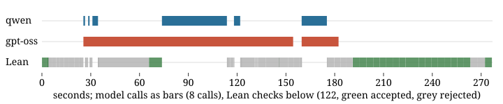

## The question

The submission (`submission/board_agent.py`, described in `docs/APPROACH.md`) puts `qwen/qwen3.5-flash-02-23` and `openai/gpt-oss-120b` on one shared Lean file. Each open `sorry` is a goal, a model takes a goal and writes one step, Lean judges it, and every statement a model writes is audited (by evaluation where the statement's binders allow it, by sampling for statements about a sequence, by the other model otherwise). This note asks what the pair solved that a single model in the kit's loop did not, and, run by run, whether the work was done by a model step, by the other model's check, or by a mechanism of the harness that asks no model at all. The short answer, from the one controlled comparison in it (three problems, two runs per cell), is pair 5 of 6 against 3 of 6 for either model in both seats and 3 of 6 for the pair without the audit, and the harness's own tactic blocks, not either model, are what closes the hard problems.

## Arms

| Arm | What it is | Runs |
| :--------------- | :------------------------------------------------------------ | :------------ |
| qwen solo | the kit's `baselines/simple_agent.py`, unmodified, with `BASELINE_MODEL=qwen/qwen3.5-flash-02-23` (1200 s per problem, cut at 1080 s, 4 workers, a GCP VM), the runs kept under `outputs/baseline/`, 10 of the 16 from an earlier session of the same run | 1 per problem |
| gpt-oss solo | the same baseline with `openai/gpt-oss-120b` (1200 s, cut at 1080 s, 5 workers, the same VM), runs kept in the same place | 1 per problem |
| board (pair) | the submission at commit `7a036d9`, `VM_TIME_LIMIT_S=1800` (sample problems) or `3600` (the harder six), `VM_BUDGET_USD=1.00`, one worker, on a 4-core WSL2 machine | 1 per problem |

The solo arms are the kit's draft-compile-repair loop, not the board with one model removed, on a different machine with a shorter clock and several workers sharing it, so the comparison does not isolate the second model as the cause. The matrix further down does that on three problems. Where a solo arm was cut by the clock the table says `t/o` (the artifact's status is `cost_unknown`, the worker killed with a model call open).

## Results

Score is the kit comparator's verdict. Wall time is in seconds, comparator excluded. For the board it is the agent's own `wall_s`. The baseline records no agent time of its own, so its cells are the harness's `wall_s` for the problem minus the comparator's `duration_ms`, both in its `result.json`. Cost is the OpenRouter spend of the board run, in dollars. "No leaves" is the same commit with `VM_LEAVES=off`, which skips the shape-built tactic blocks (`submission/leaves.py`) and leaves everything else in place, one run per problem, kept under `outputs/ablation/no-leaves/` (`rmo_2000_3` was not run). "Other runs" counts every other run of the same problem on the final commit and the seven commits before it, back to the one that introduced the leaf blocks, which differ from it only in those blocks and the four fixes to the search described in `docs/APPROACH.md`. A dagger marks a row whose run is on the commit before the final one, `12bf666`, the final commit's run of that problem not being the one kept under `outputs/board/` when this note was written.

| Problem | qwen solo | gpt-oss solo | board | cost | no leaves | other runs |
| --- | --- | --- | --- | --- | --- | --- |
| p01_linear | 1 (14) | 1 (16) | 1 (4) | 0 | 1 (4) | |
| p02_frac_cancel | 1 (15) | 1 (31) | 1 (4) | 0 | 1 (4) | |
| p03_sq_ge_two_ab | 1 (14) | 1 (51) | 1 (48) | 0.0005 | 1 (9) | |
| p04_sum_sq | 1 (14) | 1 (37) | 1 (5) | 0 | 1 (4) | |
| p05_gcd_mersenne | 0 (339) | 1 (107) | 1 (4) | 0 | 1 (4) | |
| p06_pow_mod | 1 (99) | 0 (684) | 1 (77) | 0 | 1 (77) | 2 of 2 (63 s, 82 s) |
| p07_least_divisible | 1 (354) | 1 (760) | 1 (30) | 0.0009 | 1 (16) | |
| p08_sum_products | 1 (13) | t/o | 1 (39) | 0.0005 | 1 (20) | |
| p09_imo1964 | 0 (796) | t/o | 1 (60) | 0.0004 | 1 (740) | 1 of 1 (56 s) |
| p10_factorial_pow | 0 (203) | t/o | 1 (754) | 0.041 | 1 (336) | 5 of 5 (114 to 1220 s) |
| putnam_2018_a1 | t/o | 1* (1055) | 1 (1854) | 0.053 | 0 (2674) | 8 of 9 (283 to 2611 s) |
| putnam_2020_a2 | 0 (585) | 1* (510) | 1 (67) | 0 | 0 (1234) | 4 of 4 (48 to 58 s) |
| rmo_2000_2 | 0 (794) | t/o | 1 (32) | 0 | 0 (2595) | 4 of 4 (23 to 26 s) |
| rmo_2000_3 | t/o | t/o | 0† | | not run | 0 of 4 |
| rmo_2000_6 | 0 (896) | t/o | 1 (276) | 0.006 | 1 (1823) | 9 of 16 |
| rmo_2001_2 | t/o | t/o | 1 (439)† | 0.003 | 0 (2620) | 8 of 9 (408 to 648 s) |
| **Total of 16** | **7** | **8** | **15** | | **11 of 15** | |

\* These two passes predate the kit's PR #9 ("Inline the Putnam answers so circular solutions stop scoring"). They used the answer to prove the answer and would not score now, which makes the gpt-oss solo total 6 on today's problem set.

On `rmo_2000_3`, the challenge file as shipped does not build under its own imports in the comparator (`Finset.sum` and `Finset.Ico` on ℕ need `Mathlib.Algebra.BigOperators.Group.Finset.Basic` and `Mathlib.Order.Interval.Finset.Nat`), so no solution can score on it as published. On a local copy with the two imports added, a proof of the statement written by hand compiles in the harness image in 0.6 s (a bound on each block `[j², (j+1)²)`, the block decomposition of the sum, the assembly), and the agent's runs on that copy are 0 of 5. The transcripts agree on the cause. Both models decompose the sum by `√k` instead of by the blocks and drop the factor 3 from the block bound, and the harness has a block for proving the right bound but nothing that chooses the right decomposition. That is a route search the submission does not have.

Seven of the sixteen other runs of `rmo_2000_6` failed. Five died on one goal, the lower bound `10 ≤ a * b` from the divisibility of `a ^ i * b ^ j` by 2000, before the `prime_to_bases` leaf existed, and two on faults in the cell mechanism that `docs/APPROACH.md` describes with the fixes. None bears on whether two models beat one.

## What did the work

The transcripts of the passing runs record who wrote each accepted step and what closed a goal with no model asked. The table counts, for the run of each problem kept under `outputs/board/` (the daggered two on `12bf666`), the accepted steps by model and the closures by the harness. The cocktail is the closing tactics tried before any model, the probes are the witness search, the harness's `#eval` of an answer slot and `apply?`, the leaves are the shape-built tactic blocks, and a recall is a statement proved earlier in the run and used again.

| Problem | qwen | gpt-oss | cocktail | probes | leaf | conjecture | recall |
| ------------------ | ------ | -------- | --------- | -------- | ------ | ----------- | ------- |
| p01_linear |  |  | 1 |  |  |  |  |
| p02_frac_cancel |  |  | 1 |  |  |  |  |
| p03_sq_ge_two_ab | 1 |  |  | 1 |  |  |  |
| p04_sum_sq |  |  | 1 |  |  |  |  |
| p05_gcd_mersenne |  |  | 1 |  |  |  |  |
| p06_pow_mod |  |  | 1 | 1 |  |  |  |
| p07_least_divisible |  |  | 2 |  |  |  |  |
| p08_sum_products | 1 |  |  |  |  |  |  |
| p09_imo1964 |  |  | 2 |  | 3 |  |  |
| p10_factorial_pow | 11 | 3 | 4 |  |  |  |  |
| putnam_2018_a1 | 13 | 5 | 2 |  | 1 |  | 1 |
| putnam_2020_a2 |  |  |  | 1 | 1 | 1 |  |
| rmo_2000_2 |  |  |  |  | 1 |  |  |
| rmo_2000_6 | 4 | 1 | 1 | 1 | 1 |  |  |
| rmo_2001_2 | 1 | 3 |  |  | 1 |  |  |

Three layers, and on the harder problems the second is the one that scores. One of the hard runs end to end, to show where the clock goes:

Lean was busy for 211 of the 276 s and the models for 216 s (one gpt-oss reply took 130 s), so the two overlap and neither alone is the bottleneck. The last 80 s are Lean checks that all pass, the closing sweep and the harness's own verification of the delivered file.

The first layer is the models' steps. Over the three hard runs with model steps (`rmo_2000_6`, `putnam_2018_a1`, `rmo_2001_2`) qwen wrote 18 of the 27 accepted steps from 37 tries and gpt-oss 9 from 19, and neither ordering holds on every run (on `rmo_2001_2` gpt-oss wrote more of the accepted steps, on `putnam_2018_a1` qwen's rate was the higher). gpt-oss does every model audit (2, 30 and 0 on those runs).

The second layer is Lean asked instead of a model. The cocktail closes p01, p02, p04 and p05 on the first check, the harness's `#eval` fills p06's answer slot before any model is asked, and the leaf column is the tactic blocks built from the goal's shape and tried before a model, `pow_cycle` (the residues of `2 ^ n` modulo 7 on p09), `divisor_cases` from a product equation (`putnam_2018_a1`, `rmo_2001_2`), `prime_to_bases` from a divisibility by a numeral (`rmo_2000_6`), the two-sided squeeze of a cube (`rmo_2000_2`), `sum_induct` for sum identities. Each was written after a measured failure on a goal that both models had tried and missed, and each is dispatched on the goal's shape. Whether they carry to problems they were not written against is not measured in this note, and it is the question the holdout asks. On `rmo_2000_2` and `putnam_2020_a2` the whole proof is this layer and the run costs nothing.

With the leaves off (the "no leaves" column of the results table) the ten sample problems still pass, p09 in 740 s instead of 60 (the models find the cycle of `2 ^ n` modulo 7 by themselves, slowly). Of the hard problems, `rmo_2000_6` still passes, in 1823 s instead of 276 and for $0.066 instead of $0.006, and `putnam_2020_a2`, `rmo_2000_2`, `putnam_2018_a1` and `rmo_2001_2` fail at the clock (80, 206, 211 and 220 model calls). So the leaves decide the score on four of the five hard passes and the time on the fifth, and none of the sample problems.

The third layer is a generalisation the models could not produce. `putnam_2020_a2` (`∑_{j ≤ k} 2^(k−j) C(k+j, j) = 4^k`) is not closed under induction on `k`. Asked for a generalisation with one extra parameter, the two models gave 0 true and new statements in 32 samples (gpt-oss returned the same false family eight times). The harness splits the occurrences of `k` on the left into two groups, tabulates each family in Lean, fits a library of shapes to the table, verifies a fit below 11 in both variables and posts it as a lemma (`∑_{j ≤ k} 2^(k−j) C(n+j, j) = ∑_{i ≤ k} C(n+k+1, i)`). `sum_induct` proves the lemma in 0.5 s, the theorem is rewritten by it, and `apply?` returns `Nat.sum_range_choose_halfway`. No model wrote a step of that proof.

## Where the pair added something, and where it did not

What the audits decided, by who decided them, on the pair arm of the matrix below (6 runs) and on the 15 runs under `outputs/board/`:

| Verifier | holds | refuted | unverified | not stated |
| ------------------------------ | ------ | -------- | ----------- | ----------- |
| evaluation walk, matrix pair arm | 82 | 4 | 0 | |
| gpt-oss, matrix pair arm | 19 | 2 | 23 | 51 |
| gpt-oss, final runs | 22 | 4 | 16 | 14 |

The evaluation walk (ℕ binders instantiated and the claim decided in Lean) refutes more than the auditing model does and never answers "unverified". The 15 kept runs posted no claim of the shape the walk decides, so their walk row would be empty, and the auditor was asked 0 to 30 times per run. The sampled audit over a sequence (`rmo_2000_3`) refuted 3 of 47 model statements that the auditing model had passed as "unverified".

Where the second model did not help is the step itself. The matrix on v7.91 (1800 s, two runs per cell, the 24 runs kept under `outputs/matrix/`):

| Arm | p09_imo1964 | p10_factorial_pow | rmo_2000_6 |
| ------------------------------ | ------------- | ------------------ | ------------ |
| pair, audit on (the submission) | 1 of 2 | 2 of 2 | 2 of 2 |
| qwen in both seats | 1 of 2 | 2 of 2 | 0 of 2 |
| pair, audit off | 1 of 2 | 1 of 2 | 1 of 2 |
| gpt-oss in both seats | 0 of 2 | 0 of 2 | 0 of 2 |

gpt-oss in both seats made 22 to 35 calls per run, replies of 640 to 1570 tokens at the median and 0 to 6 of them at the 4000-token cap, and scored nothing, and this note has no measured mechanism for that. The pair is the arm that did not lose `rmo_2000_6` in that matrix. Two runs per cell separate nothing finer than that.

## Architecture

What remains is a search structure. The board keeps three whole-file branches ranked by open-goal count, a stuck goal resets its cell or restarts its declaration, and a route that was 80% right is thrown away with the wrong 20% (one `rmo_2000_6` run reset the same cell 9 times with the same opening). Four of this week's fixes were to that structure rather than to any proof. A statement proved once is now recalled when the same goal reappears after a reset, a model that returns the same step for a goal is not offered that goal again until the board changes, and a hypothesis under an inaccessible name is a binder of its cell rather than a premise the link forgot to pass. `rmo_2000_3` is the problem this structure cannot reach. The pieces of its proof are in the harness, and nothing in the harness chooses between two decompositions of a sum. A proof tree with alternatives as siblings, so that a wrong decomposition is one branch and not the whole board, is the next change, and it was not made before this note.

## What would settle it

Three experiments this note does not contain. The board on a problem no leaf was written against, which is what the holdout is. The kit's baseline at 3600 s and one worker on the six problems where it was cut by the clock, so that the solo arms and the board have the same budget. And the board with one model in both seats, and with the audit disabled, on the six harder problems rather than the three in the v7.91 matrix, so that the second model's contribution on the problems that need it is measured and not inferred.
